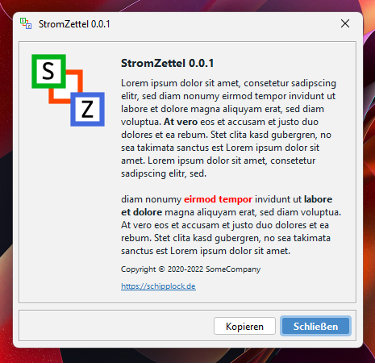

# AboutDialog

**AboutDialog** ist eine Java Bibliothek, mit der ich in einer Swing-Anwendung ohne viel Aufwand einen "about"-Dialog
darstelle.

## Screenshots



## Installation

**Das muss in die pom.xml:**

```xml
<dependency>
    <groupId>de.schipplock.gui.swing.dialogs</groupId>
    <artifactId>aboutdialog</artifactId>
    <version>0.0.3</version>
</dependency>
```

## Wie verwende ich diese Bibliothek?

**Es wird folgender Import benötigt:**

```java
import de.schipplock.gui.swing.dialogs.AboutDialog;
```

**Einen AboutDialog anzeigen:**

```java
new AboutDialog()
        .size(new Dimension(450, 425))
        .icon("logo.svg")
        .title("StromZettel 0.0.1", "#18262e")
        .text(getAboutTxt(), "#18262e")
        .copyright("2020-2022 SomeCompany", "#18262e")
        .website("https://schipplock.de", "https://schipplock.de", "#18262e")
        .center()
        .setVisible(true);
```

Diese wenigen Zeilen erzeugen einen Dialog, wie er etwas weiter oben in diesem Dokument als Screenshot gezeigt wird.
Die Datei für das Logo wird in den `resources` gesucht. Im Zweifel einfach kurz die DemoKlasse `AboutDialogDemo` anschauen.
Man kann e.g. `icon` weglassen, dann wird ein "i"-Symbol angezeigt. Das Icon skaliert mit der Fenstergröße.

## License
[Apache License 2.0](https://choosealicense.com/licenses/apache-2.0/)